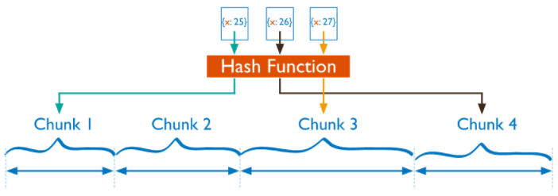
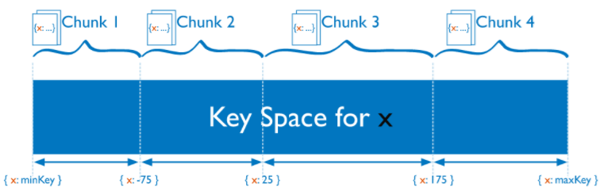
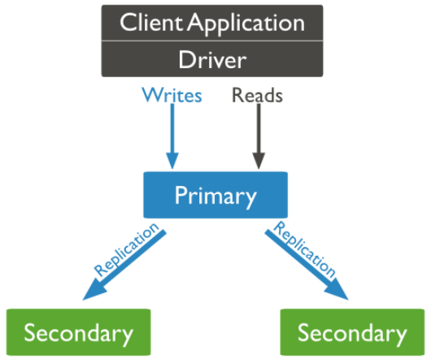
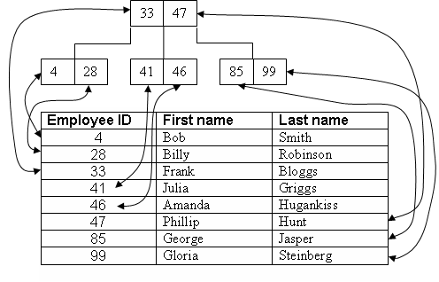

# MongoDB Notes

Notes on my experience with MongoDB. Serve as a reminder just in case I forgot something (especially some syntax).

#### Table of Contents

[1. Install MongoDB 3.6 on Ubuntu 16 LTS](#tip1)  
[2. Start MongoDB as a service](#tip2)  
[3. mongoexport](#tip3)  
[4. mongoimport](#tip4)  
[5. Sharding](#tip5)  
[6. Replica Set](#tip6)  
[7. Basic Production-leveled setup for MongoDB](#tip7)  
[8. Enable sharding for a collection](#tip8)  
[9. What is chunk?](#tip9)  
[10. Some common commands](#tip10)  
[11. MongoDB and Transaction/ACID support](#tip11)  
[12. Indexing](#tip12)  
[13. Aggregate (~ "JOIN")](#tip13)  
[14. B-tree](#tip14)  
[15. Trouble-shooting](#tip15)  

<a name="tip1"></a>
## 1. Install MongoDB 3.6 on Ubuntu 16 LTS

The last echo commands are for fixing the version to 3.6 (no automatic update whenever typing "sudo apt-get update").

```bash
sudo apt-key adv --keyserver hkp://keyserver.ubuntu.com:80 --recv 2930ADAE8CAF5059EE73BB4B58712A2291FA4AD5
echo "deb [ arch=amd64,arm64 ] https://repo.mongodb.org/apt/ubuntu xenial/mongodb-org/3.6 multiverse" | sudo tee /etc/apt/sources.list.d/mongodb-org-3.6.list
sudo apt-get update
sudo apt-get install -y mongodb-org
echo "mongodb-org hold" | sudo dpkg --set-selections
echo "mongodb-org-server hold" | sudo dpkg --set-selections
echo "mongodb-org-shell hold" | sudo dpkg --set-selections
echo "mongodb-org-mongos hold" | sudo dpkg --set-selections
echo "mongodb-org-tools hold" | sudo dpkg --set-selections
```

Allow MongoDB to be connected by any machine:

```bash
nano /etc/mongod.conf
```

```ini
# Comment out this line below.
# bind_ip = 127.0.0.1
```

See [1] for the original posting.

<a name="tip2"></a>
## 2. Start MongoDB as a service

**On Linux**:

By default, MongoDB is not automatically started when then system boots.

```bash
sudo nano /etc/systemd/system/mongodb.service
```

Fill in the content:

```ini
[Unit]
Description=High-performance, schema-free document-oriented database
After=network.target

[Service]
User=mongodb
ExecStart=/usr/bin/mongod --quiet --config /etc/mongod.conf

[Install]
WantedBy=multi-user.target
```

Then enable automatic starting:

```bash
sudo systemctl enable mongodb
```

Better to restart the machine! Lastly, check the status:

```bash
sudo systemctl status mongodb
```

**On Windows**:

Create `C:\Program Files\MongoDB\Server\3.6\mongod.cfg` with content:

```bash
systemLog:
    destination: file
    path: c:\data\log\mongod.log
storage:
    dbPath: c:\data\db
```

Create these folders:

```bash
c:\data\db
c:\data\log
```

In Command Prompt with Admin right:

```bash
"C:\Program Files\MongoDB\Server\3.6\bin\mongod.exe" --config "C:\Program Files\MongoDB\Server\3.6\mongod.cfg" --install
```

The service is created with Automatic Starting, but for the moment, it is not yet started. Either reboot the machine or start manually in Services.

<a name="tip3"></a>
## 3. mongoexport

Export a collection to a JSON file (each line is a json object).

```bash
mongoexport --host localhost --db database_name --collection collection_name --out targetproduction.json
```

Export a collection to a CSV file (we must indicate which fields in each document to export).

```bash
mongoexport --host localhost --db database_name --collection collection_name --type=csv /fields:a_specific_field,another_field --out D:\mydata.csv
```

See [2] for original posting.

<a name="tip4"></a>
## 4. mongoimport

Import JSON file into a collection (each line is a json object). Note: truncate the current collection if any.

```bash
mongoimport --db database_name --collection collection_name --drop --file ~/downloads/primer-dataset.json
```

See [3] for original posting.

<a name="tip5"></a>
## 5. Sharding

MongoDB supports horizontal scaling through sharding. Sharding is a method for distributing data across multiple machines.

Each shard contains a subset or a replica of a dataset.

To distribute the documents in a collection, MongoDB partitions the collection using the shard key. The shard key consists of an immutable field or fields that exist in every document in the target collection.

A sharded collection can have only one shard key. You cannot change the shard key after sharding, nor can you unshard a sharded collection.

If queries do not include the shard key or the prefix of a compound shard key, mongos performs a broadcast operation, querying all shards in the sharded cluster.

A database can have a mixture of sharded and unsharded collections.

Unsharded collections are stored on a primary shard. Each database has its own primary shard.

Sharding Strategy:

   - Hashed
   
   While a range of shard keys may be “close”, their hashed values are unlikely to be on the same chunk. Data distribution based on hashed values facilitates more even data distribution.
   
   However, hashed distribution means that ranged-based queries on the shard key are less likely to target a single shard, resulting in more cluster wide broadcast operations.

   
   
   - Ranged
   
   A range of shard keys whose values are "close" are more likely to reside on the same chunk.
   
   Poorly considered shard keys can result in uneven distribution of data, which can negate some benefits of sharding or can cause performance bottlenecks.
   
   

<a name="tip6"></a>
## 6. Replica Set

The point of using Replica Set is mainly to have High Availability.

It is a group of MongoDB servers operating in a primary/secondary failover fashion. At any point there can only be one primary member within the replica set, however, you can have as many secondaries as you want.

All secondaries actively replicate data off of the current primary member so that if it fails, one of them will be able to take over quite seamlessly as the new primary.

Your application will **usually** only run queries **against the primary member** in the replica set. Applications **sometimes** query secondary nodes for **read scaling**. Tell the client to opt for "read preference". See [18].

A three-member replica set can have either three members that hold data or two members that hold data and **an arbiter**. The primary is the only member in the set that can accept write operations.

It's possible that a document that has just been written won't be found on a read immediately following the write, unless you’re reading the primary. Thus, depending on the consistency requirement, we may prefer one over the other. Note: MongoDB follows "eventual consistency model".



See [4] for original posting.

<a name="tip7"></a>
## 7. Basic Production-leveled setup for MongoDB

A big picture.


* Configure Config Server

Note: They themselves should be in a Replica Set, too!

```bash
nano /etc/mongod.conf
```

```ini
replication:
  replSetName: configReplSet

sharding:
  clusterRole: configsvr
  
net:
   bindIp: 0.0.0.0
```

Then restart the service:

```bash
sudo service mongod restart
```

Then, connect to any of the Config Servers:

```javascript
rs.initiate( { _id: "configReplSet", configsvr: true, members: [ { _id: 0, host: "mongoconfig01:27019" }, { _id: 1, host: "mongoconfig02:27019" }, { _id: 2, host: "mongoconfig03:27019" } ] } )

rs.status()
```

See [6] for why port 27019 is used by default.

* Configure Shards

Note: Each shard is **also a Replica Set**!

```bash
nano /etc/mongod.conf
```

```ini
sharding:
   clusterRole: shardsvr
replication:
   replSetName: rs0
net:
   bindIp: 0.0.0.0
```

Then restart the service:

```bash
sudo service mongod restart
```

Connect to one of the MongoDB instances to initialize the replica set and declare its members.

```javascript
rs.initiate(
  {
    _id : rs0,
    members: [
      { _id : 0, host : "s1-mongo1.example.net:27018" },
      { _id : 1, host : "s1-mongo2.example.net:27018" },
      { _id : 2, host : "s1-mongo3.example.net:27018" }
    ]
  }
)
rs.status()
```

Above, one member can be optionally an arbiter by inputting `arbiterOnly: true`.

See [6] for why port 27018 is used by default.

* Configure MongoDB Router

```bash
nano /etc/mongos.conf
```

```ini
# Remove storage section from the config file!
sharding:
  configDB:configReplSet/mongoconfig01:27019,mongoconfig02:27019,mongoconfig03:27019
```

Then restart the service:

```bash
sudo service mongos restart
```

Now connecting the dots! First, connect to the MongoDB Router (mongos):

Note: mongod and mongos use the same port by default. See [6].

And run these commands:

```javascript
sh.addShard("rs0/mongosh01db01:27018")
sh.addShard("rs1/mongosh02db01:27018")

sh.status()
```

Now, within our application, connect to Mongodb Router (mongos) and query as usual.

See [5] for original posting.

<a name="tip8"></a>
## 8. Enable sharding for a collection

Before you can shard a collection, you must enable sharding for the collection’s database. Enabling sharding for a database does not redistribute data but make it possible to shard the collections in that database.

Once you enable sharding for a database, MongoDB assigns a primary shard for that database where MongoDB stores all data in that database.

First, connect to mongos (MongoDB Router). Then execute the commands:

```bash
sh.enableSharding("mydatabase")
db.mycollection.ensureIndex({myshardkey: "hashed"})
sh.shardCollection("mydatabase.mycollection", { { "myshardkey" : "hashed" } } )
```

MongoDB mongos instances route queries and write operations to shards in a sharded cluster. mongos provide the only interface to a sharded cluster from the perspective of applications. Applications *never* connect or communicate directly with the shards.

The mongos tracks what data is on which shard by caching the metadata from the config servers. The mongos uses the metadata to route operations from applications and clients to the mongod instances. A mongos has no persistent state and consumes minimal system resources.

The most common practice is to run mongos instances on the same systems as your application servers, but you can maintain mongos instances on the shards or on other dedicated resources.

The mongos merges the data from each of the targeted shards and returns the result document. 

mongos performs a broadcast operation for queries that do not include the shard key, routing queries to all shards in the cluster.

See [7], [8] for original posting.

<a name="tip9"></a>
## 9. What is chunk?

A chunk is simply a small record that describes a key range, and the shard that key range is associated to.

Initially, a chunk is created which encompasses all possible keys. For a sharded collection with a shard key “score” this may look like:

```javascript
{ "score" : { "$minKey" : 1 } } -->> { "score" : {"$maxKey":1} } on : shard0000
```

This descriptor states that any document with any score value (from theoretical minimum to maximum) will be located on the shard named “shard0000”.

Once you start populating the collection with documents, Mongo will start splitting chunks and migrating them to other shards in an attempt to keep data evenly spread across the shards. This action takes place when Mongo sees a chunk containing 64MB worth of data. Once a chunk is split, Mongo will move the one of the two chunks to another shard. It will copy all the documents which fall into the chunk’s range over to the new shard, update the config servers to point the chunk to the new shard, and finally clean up the documents from the old shard. All this work is automatic and baked into the sharding mechanism for Mongo.

This mechanism does require active management on Mongo’s part as opposed to fixed hash function over the number of shards.

But it has the advantage of allowing you to grow the cluster with ease. If you add another shard to the cluster, Mongo can migrate chunks (without splitting) draining some load off existing shards.

See [9] for original posting.

<a name="tip10"></a>
## 10. Some common commands

* Insert a document

```javascript
db.restaurants.insert(
   {
      "address" : {
         "street" : "2 Avenue",
         "zipcode" : "10075",
         "building" : "1480",
         "coord" : [ -73.9557413, 40.7720266 ]
      },
      "borough" : "Manhattan",
      "cuisine" : "Italian",
      "grades" : [
         {
            "date" : ISODate("2014-10-01T00:00:00Z"),
            "grade" : "A",
            "score" : 11
         },
         {
            "date" : ISODate("2014-01-16T00:00:00Z"),
            "grade" : "B",
            "score" : 17
         }
      ],
      "name" : "Vella",
      "restaurant_id" : "41704620"
   }
)
```

If the document passed to the insert() method does not contain the _id field, the mongo shell automatically adds the field to the document and sets the field’s value to a generated ObjectId.

* Check how many sessions & connections to MongoDB server

```javascript
db.serverStatus().connections
db.currentOp(true)
```

* Query:

Some operators: (default) AND, OR, IN.

```javascript
db.users.find( { status: "A" } )
db.users.find( { status: { $in: [ "P", "D" ] } } )
db.users.find( { status: "A", age: { $lt: 30 } } )
db.users.find(
			   {
				 status: "A",
				 $or: [ { age: { $lt: 30 } }, { type: 1 } ]
			   }
			)
db.users.find( { favorites: { artist: "Picasso", food: "pizza" } } )
db.target.find({'some_array.1':  {$exists: true}})	// array contains at least 2 elements.
db.target.find().count()	// Count elements found.
```

* Limit in find():

```javascript
db.some_collection.find().limit(5)
```

* Update

```javascript
db.products.update({'source': {$exists : false}}, {$set: {'source': 'some_source'}})
db.products.update({_id: ObjectId("584ec8f644a97b08726d4823")}, {$unset: {'heightmax_mm': 1}})
db.products.update({}, {$rename:{"category1":"name1", "category2": "name2"}}, false, true);
```

* Enumerate the cursor returned by find()

```javascript
var myCursor = db.users.find( { type: 2 } );

while (myCursor.hasNext()) {
   print(tojson(myCursor.next()));
}
```

* Show/drop databases

```javascript
show databases
use <mydb>
db.dropDatabase()
```

* Show/Rename/Copy/Drop collections

```javascript
show collections (while in some database)
db.oldname.renameCollection("newname")
db.collection1.copyTo("collection2")
db.collection1.drop()
```

* Dynamic field name:

```javascript
var name = req.params.name;
var value = req.params.value;
var query = {};
query[name] = value;
collection.findOne(query, function (err, item) { ... });
```

* Find an object based on ID:

```javascript
db.some_collection.find({_id: ObjectId("584ec8f644a97b08726d4823")})
```

* Compare ObjectID:

```javascript
if (doc._id.equals(ObjectId("584ec8f644a97b08726d4823"))){...}
```

* Get the string embeded in ObjectID

```javascript
db.hm_final.findOne()["_id"].str
```

* Convert from one type to another type:

```javascript
db.products.find().forEach(function(data) {
    db.products.update({
        "_id": data._id
    }, {
        "$set": {
            "height_mm": parseInt(data.height_mm)
        }
    });
})
```

* Get MongoDB version:

```javascript
db.version()
```

* Find a random document inside a collection

```javascript
db.products.find({category:"Category Name"}).skip(Math.random()*YOUR_COLLECTION_SIZE)
```

* Enable/Drop/List indexing

```javascript
db.products.ensureIndex({some_field: "hashed"})
db.products.createIndex({some_field: "hashed"})
db.products.dropIndexes()
db.productsDigikey.getIndexes()
```

* Disable timeout for Cursor

```javascript
db.some_collection.find().noCursorTimeout().forEach(function(doc){...}
```

* Go through all documents, change some and save/remove the changes

```javascript
db.targetproduction.find().noCursorTimeout().forEach(function(doc){
  for(var key in doc){
    if (key == "invalid_key") {
	  delete (doc[key]);
	  db.targetproduction.save(doc)
	  //db.targetproduction.remove(doc)
    } else {
	  doc["duplicated" + key] = doc[key]
	}
  }
})
```

* Get all field names of an object

```javascript
if (Object.keys(features).length > 0){
  print("There is " + Object.keys(features).length + " features")
}
```

* Get collection based on name

```javascript
db.getCollection("some_name")
```

* Get index size

```javascript
db.some_collection.stats().indexSizes
```

* Check if index has been used

```javascript
db.some_collection.aggregate([ { $indexStats: { } } ])
```

Run this once before running your own script. Then run it again after your own script.

<a name="tip11"></a>
## 11. MongoDB and Transaction/ACID support

In MongoDB, a write operation is atomic on the level of a single document, even if the operation modifies multiple embedded documents within a single document.

When a single write operation modifies multiple documents, **the modification of each document is atomic**, but the operation as a whole is not atomic and other operations may interleave.

Workaround:

* Embed all needed information in one document within the collection. That is, For fields that must be updated together, embedding the fields within the same document ensures that the fields can be updated atomically. E.g.: A Product document, beside product info, also contains "Who buys" field.

  And then use MongoDB's functions such as `findAndModify()`, `update()`, etc. to ensure data modification to be done atomically.
  
  Note: the difference between `findAndModify()` and `update()` is the former supports "set-then-get" in one step (no interference by outside). `update()` can modify more than one document with *multi* option.

* two-phase commit: See [11].

MULTIDOCUMENT UPDATES:

```javascript
db.products.update({}, {$addToSet: {tags: 'cheap'}}, {multi: true})
```

Updates are atomic at a document level, which means that a statement that has to update 10 documents might fail for some reason after updating the first 3 of them. The application has to deal with such failures according to its policy. Thus, **no transaction here!**.

Take-away: **Complex** transaction-styled operations are likely not possible in MongoDB.

See [10] for original posting.

<a name="tip12"></a>
## 12. Indexing

Without indexes, MongoDB must perform a collection scan, i.e. scan every document in a collection, to select those documents that match the query statement. If an appropriate index exists for a query, MongoDB can use the index to limit the number of documents it must inspect.

**Index intersection** was first supported by version 2.6 of MongoDB. Keep in mind that the database will use a single index per query **if possible**. Thus, if queries **usually** involve at least two fields, create Compound Index (rather than two separate Single Field indexes).

Although indexes are essential for good query performance, each new index imposes a **small maintenance cost**. Whenever you add a document to a collection, each index on that collection must be modified to include the new document.

Bear in mind that indexes are stored separately in RAM from the data they index and aren't clustered.

By default, MongoDB builds indexes in the foreground, which prevents all read and write operations to the database while the index builds. Background index builds take longer to complete and result in an index that is initially larger, or less compact, than an index built in the foreground. Over time, the compactness of indexes built in the background will approach foreground-built indexes.

```javascript
db.collection.createIndex( { a: 1 }, { background: true } )
```

If your application heavily updates existing data or performs a lot of large deletions, you may end up with a **highly fragmented** index. The primary symptom of a fragmented index is an index size much larger than you'd expect for the given data size. ==> Use more RAM than necessary. You may want to consider rebuilding one or more indexes.

```javascript
db.values.reIndex()
```

Index Types

* Single Field:

```javascript
db.records.createIndex({ score: 1 })	// ascending
db.records.createIndex({ score: -1 })	// descending
```

Unique index can be created with option "unique":

```javascript
db.users.createIndex({username: 1}, {unique: true})
```

Sometime, there are documents without the field needed to be indexed, we can ignore updating the index whenever involving such documents by using "sparse index":

```javascript
db.reviews.createIndex({user_id: 1}, {sparse: true, unique: false})
```

* Compound Index:

```javascript
db.products.createIndex( { "item": 1, "stock": 1 } )
```

Compound means "together": the indexing on item/stock are **tightly related in the order** ("item" first, then "stock"). Thus, when querying, the searched criteria must follow "prefixes", e.g.: provide both "item" and "stock" respectively; or provide only "item". See [15].

Compound index costs more space than the indexes of each individual field. See [16].

Trick: The order of fields in Compound Index **really matters**! Try to put fields where concrete values are often seeked first, and then fields where ranged values are often queries (e.g. "less than").

* Multikey Index:

MongoDB automatically determines whether to create a multikey index if the indexed field **contains an array value**; you do not need to explicitly specify the multikey type.

MongoDB creates **an index key for each element in the array**.

```javascript
{
	book: "Artificial Intelligence",
	tags: ["ai", "machine learning", "intelligence"]
}
```

Limitations: You cannot create a compound multikey index if more than one to-be-indexed field of a document is an array.

* Geospatial Index:

To support efficient queries of geospatial coordinate data.

* Text Indexes:

Purpose: Full-Text Search. Similar to Google Search, Wikipedia Search. **Only useful** in case of using $text query operations.

When we create a text index on a field, MongoDB tokenizes (remove **stop words**), and **stems** the indexed field’s text content, and sets up the indexes accordingly.

Text indexes come with a limitation of only **one text index per collection**.

Example1: on one field.

```javascript
db.messages.createIndex({"subject":"text"})  
db.messages.find({$text: {$search: "dogs"}}, {score: {$meta: "textScore"}}).sort({score:{$meta:"textScore"}})
```

Example2: on multiple fields.

```javascript
db.messages.createIndex({"subject":"text","content":"text"})
```

Example3: on all fields.

```javascript
db.messages.createIndex({"$**":"text"})
```

Example4: Phrase Search (By default: OR)

```javascript
db.messages.find({$text: {$search: "\"cook food\""}}, {score: {$meta: "textScore"}}).sort({score:{$meta:"textScore"}})
```

Example5: Negation Search (use minus sign)

```javascript
db.messages.find({$text: {$search: "rat -birds"}}, {score: {$meta: "textScore"}}).sort({score:{$meta:"textScore"}})
```

Explain the query: See how MongoDB interprets the input query.

```javascript
db.messages.find({$text: {$search: "dogs who cats dont eat ate rats \"dogs eat\" -friends"}}, {score: {$meta: "textScore"}}).sort({score:{$meta:"textScore"}}).explain(true)
```

The default weight for every indexed field is 1. If using different weights for different fields, configure when creating indexes:

```javascript
db.messages.createIndex( {"$**": "text"}, {"weights": { subject: 3, content:1 }} )
```

Partitioning Text Indexes: Using compound index.

```javascript
db.messages.createIndex( { "year":1, "subject": "text"} )
db.messages.find({year: 2015, $text: {$search: "cats"}}, {score: {$meta: "textScore"}}).sort({score:{$meta:"textScore"}})
```

Note: Keeping in mind the fact that MongoDB full-text search is **not** a complete replacement for traditional search engine databases used with MongoDB.

* Hashed Indexes:

Hashed indexes support only equality comparison and do not support range queries. Useful when the data is distributed non-uniformly AND we want to leverage Sharding.

Create a Hashed Index:

```javascript
db.collection.createIndex( { _id: "hashed" } )
```

See [12], [13], [14], [15], [20] for original posting.

<a name="tip13"></a>
## 13. Aggregate (~ "JOIN")

Command Aggregate can be used in a very flexible way, as a series of activities (or "data pipeline").

```javascript
db.getCollection.('tb1').aggregate([
  // Filter conditions from the source collection
  { "$match": { "status": { "$ne": "closed" } }},

  // Do the first join
  { "$lookup": {
    "from": "tb2",
    "localField": "id",
    "foreignField": "profileId",
    "as": "tb2"
  }},

  // $unwind the array to denormalize
  { "$unwind": "$tb2" },

  // Then match on the condtion for tb2
  { "$match": { "tb2.profile_type": "agent" } },

  // join the second additional collection
  { "$lookup": {
    "from": "tb3",
    "localField": "tb2.id",
    "foreignField": "id",
    "as": "tb3"
  }},

  // $unwind again to de-normalize
  { "$unwind": "$tb3" },

  // Now filter the condition on tb3
  { "$match": { "tb3.status": 0 } },

  // Project only wanted fields. In this case, exclude "tb2"
  { "$project": { "tb2": 0 } }
])
```

It seems that $lookup ~ LEFT OUTER JOIN in SQL.

See [17] for original posting.

<a name="tip14"></a>
## 14. B-tree

MongoDB represents most indexes internally as B-trees.

Why use B-tree? First, they facilitate a variety of queries, including exact matches, range conditions, sorting, prefix matching, and index-only queries. Second, they’re able to remain balanced in spite of the addition and removal of keys.

An example:



B-Tree is preferred over Binary Search Tree because many keys can be stored in a node, resulting it being cached effectively in CPU, and also more convenient to read data from HDD (cluster, sector).

See [19] for original posting.

<a name="tip15"></a>
## 15. Trouble-shooting

* Check if query time is considered as "slow" (**> 100ms**)

View the MongoDB log file:

```bash
cat /etc/mongod.conf
# Look for mongod.log
cat /var/log/mongodb/mongod.log
```

```bash
2017-12-25T14:12:28.298+0100 I COMMAND  [conn4] command stocks.values appName: "MongoDB Shell" command: find { find: "values", filter: { stock_symbol: "GOOG" }, limit: 1.0, singleBatch: false, sort: { date: -1.0 }, $db: "stocks" } planSummary: COLLSCAN keysExamined:0 docsExamined:4308303 hasSortStage:1 cursorExhausted:1 numYields:33726 nreturned:1 reslen:263 locks:{ Global: { acquireCount: { r: 67454 } }, Database: { acquireCount: { r: 33727 } }, Collection: { acquireCount: { r: 33727 } } } protocol:op_msg 8775ms
```

* Use built-in PROFILER

```javascript
use stocks
db.setProfilingLevel(2) // most verbal
db.setProfilingLevel(1) // log only slow (100 ms) operations
db.setProfilingLevel(0) // disable
```

Some commands:

```javascript
db.system.profile.find({millis: {$gt: 150}})
db.system.profile.find().sort({$natural: -1}).limit(5).pretty()
```

* Use explain():

```javascript
db.values.find({}).sort({close: -1}).limit(1).explain()
{
    "cursor" : "BasicCursor",
    "isMultiKey" : false,
    "n" : 1,
    "nscannedObjects" : 4308303,
    "nscanned" : 4308303,
    "nscannedObjectsAllPlans" : 4308303,
    "nscannedAllPlans" : 4308303,
    "scanAndOrder" : true,
    "indexOnly" : false,
    "nYields" : 4,
    "nChunkSkips" : 0,
    "millis" : 10927,
    "indexBounds" : { },
    "server" : "localhost:27017"
}
```

n: number of documents returned.  
nscanned: number of documents scanned. (The closer to n, the better)  
cursor: BasicCursor, BTreeCursor (when index used!).  
scanAndOrder: if true, MongoDB sorts the result set manually (without using index).  

See [21] for origin posting.

# References

[1] https://docs.mongodb.com/manual/tutorial/install-mongodb-on-ubuntu/

[2] https://docs.mongodb.com/manual/reference/program/mongoexport/

[3] https://docs.mongodb.com/manual/reference/program/mongoimport/

[4] https://eladnava.com/deploy-a-highly-available-mongodb-replica-set-on-aws/

[5] http://codingmiles.com/mongodb-sharded-cluster-deployment/

[6] https://docs.mongodb.com/manual/reference/default-mongodb-port/

[7] https://docs.mongodb.com/manual/tutorial/deploy-shard-cluster/

[8] https://docs.mongodb.com/v3.4/core/sharded-cluster-query-router/

[9] http://plusnconsulting.com/post/mongodb-sharding-and-chunks/

[10] https://docs.mongodb.com/manual/core/write-operations-atomicity/

[11] https://docs.mongodb.com/manual/tutorial/perform-two-phase-commits/

[12] https://docs.mongodb.com/manual/indexes/

[13] https://code.tutsplus.com/tutorials/full-text-search-in-mongodb--cms-24835

[14] https://docs.mongodb.com/manual/core/index-multikey/

[15] https://docs.mongodb.com/manual/core/index-compound/#prefixes

[16] https://dev.to/weiiishannn/compound-index-vs-multiple-single-field-index-in-mongodb-3x

[17] https://stackoverflow.com/questions/44948677/how-to-join-to-two-additional-collections-with-conditions

[18] https://severalnines.com/blog/become-mongodb-dba-how-scale-reads

[19] https://en.wikipedia.org/wiki/B-tree

[20] https://docs.mongodb.com/v3.0/tutorial/build-indexes-in-the-background/

[21] https://www.amazon.com/MongoDB-Action-Covers-version-3-0/dp/1617291609
